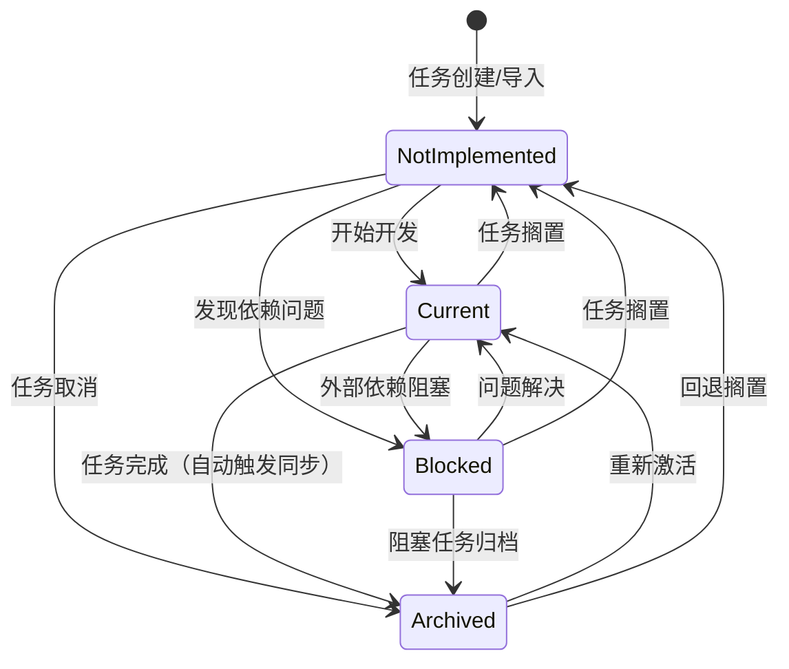
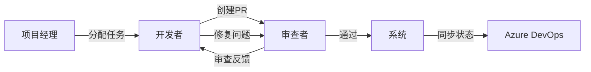

# 标准开发流程文档

## 1. 流程概述

本文档定义了基于 Azure DevOps MCP Server 的标准开发流程，旨在确保团队协作高效、代码质量可控。

---

## 2. 端到端流程架构

### 2.1 流程阶段图

```
项目初始化 → 仓库映射配置 → 任务拉取 → 需求分析 → TDD开发 → 代码分析 → 代码提交 → 代码审查 → 状态同步 → 任务归档
```

### 2.2 流程阶段详情

| 阶段 | 说明 | 负责人 | 工具/命令 | 输出物 |
|------|------|--------|-----------|--------|
| **项目初始化** | 使用初始化脚本配置本地开发环境 | 开发者 | `init-project.ps1/sh` | 配置完成的开发环境 |
| **仓库映射配置** | 建立本地仓库与 Azure Boards 的关联 | 开发者 | `SetRepositoryMapping()` | 仓库映射记录 |
| **任务拉取** | 获取指派给当前用户且关联当前仓库的任务 | 开发者 | `GetAssignedWorkItemsForCurrentRepository()` | 任务列表 |
| **需求分析** | 深入理解任务需求，建立共享语言 | 开发者 | `/grill-with-docs` | CONTEXT.md 更新 |
| **TDD开发** | 使用测试驱动开发完成功能实现 | 开发者 | `/tdd` | 测试代码 + 实现代码 |
| **代码分析** | 分析代码修改的影响范围 | 开发者 | `gitnexus impact()` | 影响分析报告 |
| **代码提交** | 提交代码到版本控制仓库 | 开发者 | `git commit` | 代码变更 |
| **代码审查** | 确保代码质量，共享知识 | 审查者 | PR Review | 审查意见 |
| **状态同步** | 保持任务状态在本地和 Azure DevOps 之间同步 | 系统/开发者 | `SyncTaskToAzureDevOps()` | 同步记录 |
| **任务归档** | 标记任务完成，进入最终状态 | 开发者/系统 | `UpdateTaskStatus()` | 归档任务 |

---

## 3. 四状态任务模型

### 3.1 状态定义

| 状态 | 代码值 | 说明 |
|------|--------|------|
| **NotImplemented** | `notImplemented` | 尚未开始或被搁置的任务 |
| **Current** | `current` | 当前任务（正在开发） |
| **Blocked** | `blocked` | 阻塞中（外部依赖） |
| **Archived** | `archived` | 归档（完成验证） |

### 3.2 状态流转图



### 3.3 状态流转规则

| 源状态 | 目标状态 | 是否允许 | 说明 | 同步行为 |
|--------|----------|----------|------|----------|
| NotImplemented | Current | ✅ | 开始任务开发 | - |
| NotImplemented | Blocked | ✅ | 任务因依赖问题被阻塞 | - |
| NotImplemented | Archived | ✅ | 任务被取消或搁置 | 同步到 Azure |
| Current | Blocked | ✅ | 任务因外部依赖或问题被阻塞 | - |
| Current | NotImplemented | ✅ | 任务被搁置，回退至未实现状态 | - |
| Current | Archived | ✅ | 任务完成并归档 | **自动同步到 Azure** |
| Blocked | Current | ✅ | 阻塞问题已解决，恢复任务开发 | - |
| Blocked | NotImplemented | ✅ | 任务被搁置，回退至未实现状态 | - |
| Blocked | Archived | ✅ | 阻塞任务被归档 | 同步到 Azure |
| Archived | Current | ✅ | 任务被重新激活 | 同步到 Azure |
| Archived | NotImplemented | ✅ | 归档任务被回退至未实现状态 | 同步到 Azure |

---

## 4. 任务生命周期模式

### 4.1 正常流程

```
NotImplemented → Current → Archived
```

**场景**：任务顺利完成，没有遇到阻塞或搁置。

### 4.2 阻塞流程

```
NotImplemented → Current → Blocked → Current → Archived
```

**场景**：开发过程中遇到外部依赖问题，问题解决后继续完成。

### 4.3 搁置流程

```
NotImplemented → Current → NotImplemented → Current → Archived
```

**场景**：任务暂时搁置，之后重新激活完成。

### 4.4 取消流程

```
NotImplemented → Archived
```

**场景**：任务在开始前被取消。

---

## 5. 状态同步机制

### 5.1 同步触发条件

| 触发方式 | 说明 | 优先级 |
|----------|------|--------|
| **自动同步** | 任务状态变为 `Archived` 时自动触发 | 高 |
| **定时同步** | 默认每 5 分钟检查一次待同步任务 | 中 |
| **手动同步** | 调用 `SyncTaskToAzureDevOps(workItemId)` | 按需 |

### 5.2 同步方向

```
本地任务状态 → Azure DevOps Work Item 状态
```

### 5.3 状态映射表

| 内部状态 | Azure DevOps 状态 |
|----------|-------------------|
| NotImplemented | New |
| Current | Active |
| Blocked | Active |
| Archived | Closed |

---

## 6. 角色与职责

### 6.1 角色职责矩阵

| 角色 | 职责 | 关键活动 |
|------|------|----------|
| **开发者** | 执行开发任务、编写测试、提交代码 | 需求分析、TDD开发、代码分析、代码提交 |
| **代码审查者** | 审查代码质量、确保符合规范 | PR审查、提供改进建议 |
| **管理员** | 配置项目映射、管理用户权限 | 仓库映射配置、用户映射管理 |
| **系统** | 自动同步任务状态、执行定时任务 | 状态同步、定时检查 |
| **项目经理** | 跟踪项目进度、解决瓶颈问题 | 查看仪表板、处理阻塞任务 |

### 6.2 协作流程



---

## 7. 工具支持体系

### 7.1 核心工具

| 工具 | 用途 | 集成方式 |
|------|------|----------|
| **MCP Server** | 提供任务管理 API | 核心服务 |
| **Azure DevOps** | 任务来源和状态同步目标 | 外部集成 |
| **GitNexus** | 代码质量分析和影响评估 | 代码分析 |
| **TDD Skill** | 测试驱动开发支持 | 开发流程 |

### 7.2 辅助工具

| 工具 | 用途 | 使用时机 |
|------|------|----------|
| `/grill-with-docs` | 需求分析和领域语言建立 | 任务开始 |
| `/tdd` | 测试驱动开发 | 功能实现 |
| `/diagnose` | 结构化调试 | 问题排查 |
| `/improve-codebase-architecture` | 架构优化 | 重构阶段 |
| `/task-workflow` | 完整任务开发工作流 | 端到端流程 |

---

## 8. 最佳实践

### 8.1 流程最佳实践

| 实践 | 说明 |
|------|------|
| **保持任务粒度适中** | 单个任务应在 1-2 天内完成 |
| **及时更新状态** | 任务状态变化应及时反映到系统中 |
| **TDD 优先** | 先编写测试，再实现功能 |
| **代码审查** | 所有代码提交前必须经过审查 |
| **自动化测试** | 确保所有测试通过后才能提交 |
| **代码分析** | 提交前使用 GitNexus 分析影响范围 |

### 8.2 协作最佳实践

| 实践 | 说明 |
|------|------|
| **明确需求** | 使用 `/grill-with-docs` 确保需求理解一致 |
| **及时沟通** | 遇到阻塞时及时报告，避免延误 |
| **文档更新** | 及时更新 CONTEXT.md 和 ADR |
| **知识共享** | 通过代码审查分享经验 |

---

## 9. 质量保障检查清单

### 9.1 代码提交前检查

- [ ] 单元测试覆盖率 ≥ 80%
- [ ] 所有测试通过
- [ ] GitNexus 分析无高风险问题
- [ ] 代码符合编码规范
- [ ] 提交信息符合规范

### 9.2 代码审查检查

- [ ] 代码正确性
- [ ] 代码质量和可读性
- [ ] 测试覆盖完整性
- [ ] 性能考虑
- [ ] 安全考虑
- [ ] 文档完善

---

## 10. 版本历史

| 版本 | 日期 | 变更说明 |
|------|------|----------|
| 1.0 | 2024-01-15 | 初始版本 |
| 1.1 | 2024-02-01 | 添加状态同步流程 |
| 1.2 | 2024-03-01 | 更新分支管理策略 |
| 2.0 | 2024-06-11 | 重构流程架构，扩展为十阶段流程 |