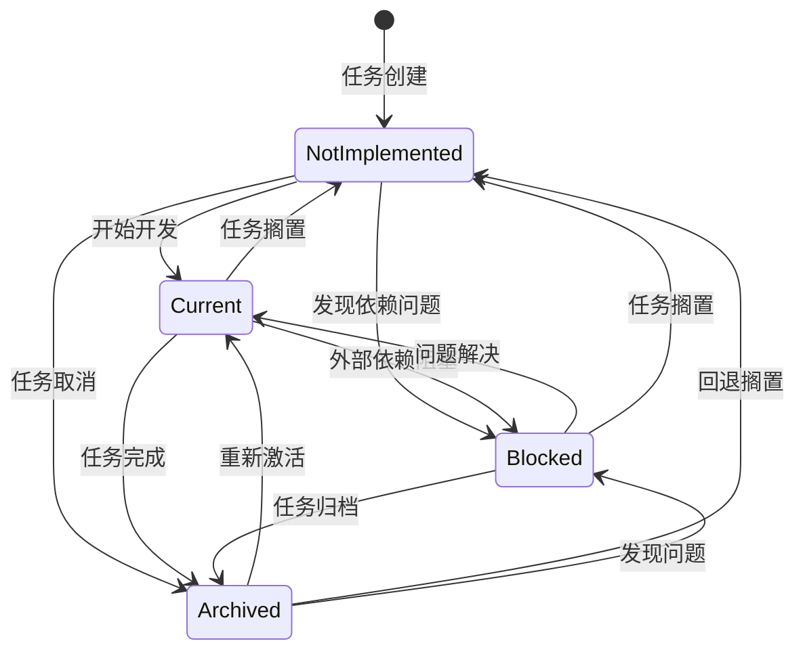

# 标准开发流程文档

## 1. 流程概述

本文档定义了基于 Azure DevOps MCP Server 的标准开发流程，旨在确保团队协作高效、代码质量可控。

## 2. 标准开发流程

### 2.1 流程图

```
初始化 → 配置项目映射 → 拉取任务 → 需求分析 → TDD 开发 → 代码分析 → 提交 → 同步状态
```

### 2.2 流程详细说明

| 阶段 | 说明 | 负责人 |
|------|------|--------|
| **初始化** | 使用 `init-project` 脚本初始化本地开发环境 | 开发者 |
| **配置项目映射** | 配置本地项目与 Azure DevOps 项目的映射关系 | 开发者/管理员 |
| **拉取任务** | 从 Azure DevOps 拉取待开发任务到本地 | 开发者 |
| **需求分析** | 分析任务需求，制定开发计划 | 开发者 |
| **TDD 开发** | 使用测试驱动开发完成功能实现 | 开发者 |
| **代码分析** | 使用 GitNexus 进行代码质量分析 | 开发者 |
| **提交** | 提交代码到版本控制仓库 | 开发者 |
| **同步状态** | 任务完成后自动同步状态到 Azure DevOps | 系统自动 |

## 3. 四状态任务模型

### 3.1 状态定义

| 状态 | 名称 | 说明 |
|------|------|------|
| `NotImplemented` | 未实现 | 尚未开始或被搁置的任务 |
| `Current` | 当前任务 | 正在积极开发中的任务 |
| `Blocked` | 阻塞中 | 因外部依赖或问题无法继续推进的任务 |
| `Archived` | 归档 | 已完成所有验证步骤的任务 |

### 3.2 状态流转规则



### 3.3 状态流转详细规则

| 源状态 | 目标状态 | 是否允许 | 说明 |
|--------|----------|----------|------|
| NotImplemented | Current | ✅ | 开始任务开发 |
| NotImplemented | Blocked | ✅ | 任务因依赖问题被阻塞 |
| NotImplemented | Archived | ✅ | 任务被取消或搁置 |
| Current | Blocked | ✅ | 任务因外部依赖或问题被阻塞 |
| Current | NotImplemented | ✅ | 任务被搁置，回退至未实现状态 |
| Current | Archived | ✅ | 任务完成并归档，将自动同步到 Azure DevOps |
| Blocked | Current | ✅ | 阻塞问题已解决，恢复任务开发 |
| Blocked | NotImplemented | ✅ | 任务被搁置，回退至未实现状态 |
| Blocked | Archived | ✅ | 阻塞任务被归档 |
| Archived | Current | ✅ | 任务被重新激活 |
| Archived | NotImplemented | ✅ | 归档任务被回退至未实现状态 |
| Archived | Blocked | ✅ | 归档任务转为阻塞状态 |

## 4. 任务生命周期

### 4.1 正常流程

```
NotImplemented → Current → Archived
```

### 4.2 阻塞流程

```
NotImplemented → Current → Blocked → Current → Archived
```

### 4.3 搁置流程

```
NotImplemented → Current → NotImplemented → Current → Archived
```

## 5. 状态同步机制

### 5.1 自动同步触发条件

- 任务状态变为 `Archived` 时自动触发同步到 Azure DevOps
- 定时同步（默认每 5 分钟检查一次待同步任务）

### 5.2 同步方向

```
本地任务状态 → Azure DevOps Work Item 状态
```

### 5.3 状态映射

| 本地状态 | Azure DevOps 状态 |
|----------|-------------------|
| NotImplemented | New |
| Current | Active |
| Blocked | Active |
| Archived | Closed |

## 6. 角色与职责

| 角色 | 职责 |
|------|------|
| **开发者** | 执行开发任务、编写测试、提交代码 |
| **代码审查者** | 审查代码质量、确保符合规范 |
| **管理员** | 配置项目映射、管理用户权限 |
| **系统** | 自动同步任务状态、执行定时任务 |

## 7. 工具支持

- **MCP Server**: 提供任务管理 API
- **Azure DevOps**: 任务来源和状态同步目标
- **GitNexus**: 代码质量分析
- **TDD Skill**: 测试驱动开发支持

## 8. 最佳实践

1. **保持任务粒度适中**：单个任务应在 1-2 天内完成
2. **及时更新状态**：任务状态变化应及时反映到系统中
3. **TDD 优先**：先编写测试，再实现功能
4. **代码审查**：所有代码提交前必须经过审查
5. **自动化测试**：确保所有测试通过后才能提交