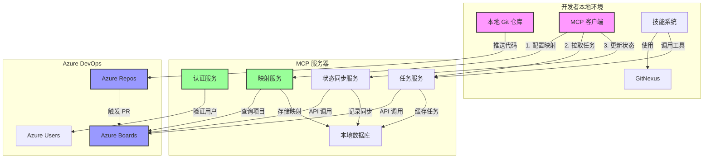
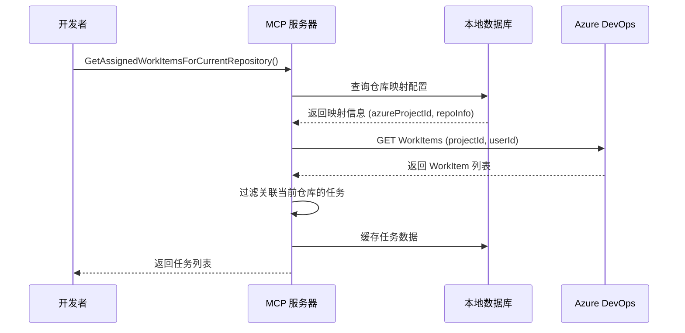
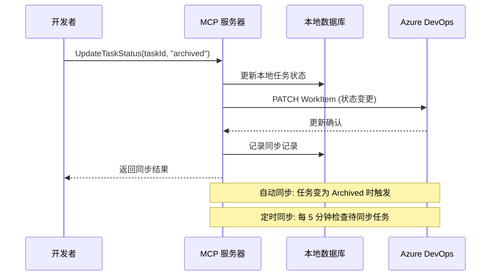
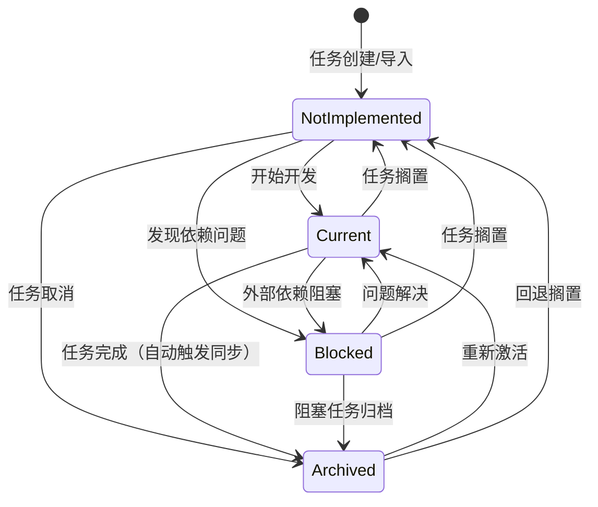
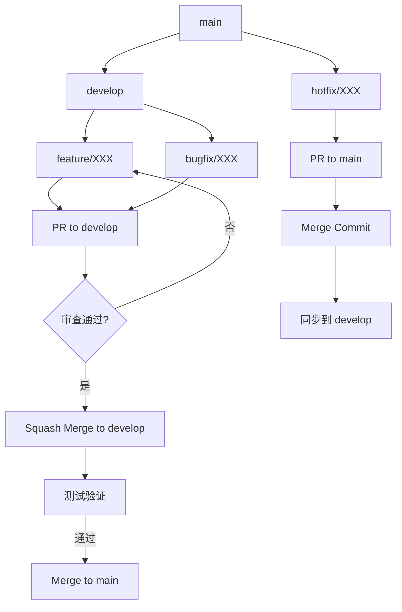

# 开发流程规范

## 概述

本文档定义了团队使用开发管理平台进行任务开发的标准流程。所有团队成员应遵循此流程进行日常开发工作。

---

## 一、流程架构总览

### 1.1 端到端流程架构图

```
┌──────────────────────────────────────────────────────────────────────────────┐
│                        开发管理平台 - 标准工作流                              │
├──────────────────────────────────────────────────────────────────────────────┤
│                                                                              │
│  ┌──────────────┐    ┌──────────────┐    ┌──────────────┐                   │
│  │  项目初始化   │───→│  仓库映射配置  │───→│  任务拉取     │                   │
│  │  init-project│    │ SetRepository │    │ GetAssigned  │                   │
│  └──────────────┘    └──────────────┘    └──────┬───────┘                   │
│                                                  │                           │
│                                                  ▼                           │
│  ┌──────────────┐    ┌──────────────┐    ┌──────────────┐    ┌──────────────┐│
│  │   代码提交    │←───│   代码分析    │←───│   TDD开发    │←───│   需求分析    ││
│  │   git commit │    │gitnexus impact│    │   /tdd       │    │/grill-with-  ││
│  └──────┬───────┘    └──────────────┘    └──────────────┘    │ docs        ││
│         │                                                     └──────────────┘│
│         ▼                                                                     │
│  ┌──────────────┐    ┌──────────────┐    ┌──────────────┐                   │
│  │   状态同步    │───→│   代码审查    │───→│   任务归档    │                   │
│  │ SyncToAzure  │    │   PR Review  │    │  Archived    │                   │
│  └──────────────┘    └──────────────┘    └──────────────┘                   │
│                                                                              │
└──────────────────────────────────────────────────────────────────────────────┘
```

### 1.2 流程阶段概览

| 阶段 | 工具/命令 | 负责人 | 输出物 |
|------|-----------|--------|--------|
| **初始化** | `init-project.ps1/sh` | 开发者 | 配置完成的开发环境 |
| **仓库映射** | `SetRepositoryMapping()` | 开发者 | 仓库映射配置 |
| **任务拉取** | `GetAssignedWorkItemsForCurrentRepository()` | 开发者 | 任务列表 |
| **需求分析** | `/grill-with-docs` | 开发者 | CONTEXT.md 更新 |
| **TDD开发** | `/tdd` | 开发者 | 测试代码 + 实现代码 |
| **代码分析** | `gitnexus impact()/context()` | 开发者 | 影响分析报告 |
| **代码提交** | `git commit` | 开发者 | 代码变更 |
| **代码审查** | PR Review | 审查者 | 审查意见 |
| **状态同步** | `SyncTaskToAzureDevOps()` | 系统 | 状态同步记录 |
| **任务归档** | `UpdateTaskStatus()` | 开发者/系统 | 归档任务 |

---

## 二、三方关系与数据流架构

### 2.1 角色关系定义

根据 PRD 设计，整个系统由三个核心角色构成：

| 角色 | 定位 | 职责 | 存储数据 |
|------|------|------|----------|
| **开发者** | 客户端/用户 | 执行开发任务、使用技能、提交代码 | 本地仓库、本地配置 |
| **MCP 服务器** | 中间层/代理 | 提供统一 API、认证、状态管理、数据映射 | 项目映射、任务缓存、用户映射 |
| **Azure DevOps** | 后端数据源 | 任务存储、状态管理、项目管理 | Work Items、Projects、Repos |

### 2.2 三方关系架构图



### 2.3 数据流方向与协议

#### 2.3.1 认证数据流

```
开发者 → MCP 服务器 → Azure DevOps
    │         │              │
    │  Windows │   服务端 PAT │
    │  集成认证 │   (后台配置) │
    ▼         ▼              ▼
   当前用户  验证身份    获取项目权限
```

#### 2.3.2 任务拉取数据流



#### 2.3.3 状态同步数据流



### 2.4 仓库映射的作用与机制

#### 2.4.1 映射配置结构

```mcp
SetRepositoryMapping(
  localProject: "my-project",           // 本地项目名称
  workingDirectory: "/workspace/my-project", // 本地工作目录
  repositoryProvider: "GitHub",         // 仓库提供方
  repositoryOwner: "my-org",            // 仓库所有者
  repositoryName: "my-project",         // 仓库名称
  remoteUrl: "https://github.com/org/my-project.git",
  azureProjectId: "xxxx-xxxx-xxxx",     // Azure DevOps 项目ID
  azureProjectName: "MyAzureProject",   // Azure DevOps 项目名称
  isDefault: true                       // 是否默认映射
)
```

#### 2.4.2 映射的两层含义

| 层级 | 含义 | 作用 |
|------|------|------|
| **查询边界** | Azure DevOps Project ID | 限定 WorkItem 查询范围 |
| **归属边界** | WorkItem 上的仓库关联 | 通过 ArtifactLink 确定任务归属 |

#### 2.4.3 任务归属判定逻辑

```
1. 开发者调用 GetAssignedWorkItemsForCurrentRepository()
2. MCP 服务器获取当前目录的仓库映射配置
3. 根据映射配置查询 Azure DevOps Project 内的 WorkItems
4. 过滤条件：
   - 指派给当前用户
   - WorkItem 上存在指向当前仓库的 ArtifactLink
     (GitHub Branch/Commit/PR/Issue 或 Azure Repos 关联)
5. 返回过滤后的任务列表
```

### 2.5 关键设计原则

| 原则 | 说明 |
|------|------|
| **解耦性** | 开发者不直接访问 Azure DevOps，通过 MCP 服务器代理 |
| **安全性** | 服务端 PAT 统一管理，开发者使用 Windows 认证 |
| **缓存机制** | MCP 服务器缓存任务数据，减少 Azure API 调用 |
| **异步同步** | 状态变更支持自动同步和定时同步，保证最终一致性 |
| **项目隔离** | 通过映射配置实现不同项目使用不同 Azure DevOps 项目 |

---

## 三、详细流程步骤

### 3.1 阶段一：项目初始化

**目的**：快速配置新项目的开发环境

**操作步骤**：

```bash
# Windows
Invoke-Expression (Invoke-WebRequest -Uri https://platform.company.com/init-project.ps1 -UseBasicParsing).Content

# Linux/Mac
curl -sSL https://platform.company.com/init-project.sh | bash
```

**脚本执行内容**：
1. 检查系统依赖（Node.js ≥ 18.0.0、Git）
2. 安装 GitNexus 并运行代码索引
3. 安装 mattpocock skills
4. 配置 MCP 连接（启用 Windows 集成认证）
5. 生成初始 CONTEXT.md
6. 创建 docs/adr/ 目录

**跳过参数**：
- `--skip-gitnexus`: 跳过 GitNexus 安装
- `--skip-skills`: 跳过 Skills 安装

---

### 3.2 阶段二：仓库映射配置

**目的**：建立本地代码仓库与 Azure Boards 的关联关系

**操作方式**：

```mcp
SetRepositoryMapping(
  localProject: "my-project",
  azureProjectId: "xxxx-xxxx-xxxx",
  azureProjectName: "MyAzureProject",
  repositoryId: "repo-123",
  repositoryName: "my-project",
  remoteUrl: "https://github.com/org/my-project.git",
  organization: "my-org",
  workingDirectory: "/workspace/my-project",
  isDefault: true,
  repositoryProvider: "GitHub",
  repositoryOwner: "my-org"
)
```

**关键说明**：
- **查询边界**：Azure DevOps Project 限定 WorkItem 查询范围
- **归属边界**：任务归属通过 WorkItem 上的仓库关联关系确定（Branch/Commit/PR/Issue）

---

### 3.3 阶段三：任务拉取

**目的**：获取指派给当前用户且关联当前仓库的任务列表

**操作方式**：

```mcp
# 方式1：基于当前仓库（已配置映射）
GetAssignedWorkItemsForCurrentRepository()

# 方式2：指定仓库参数
GetAssignedWorkItemsForRepository(
  repositoryProvider: "GitHub",
  repositoryOwner: "my-org",
  repositoryName: "my-project",
  projectId: "xxxx-xxxx"
)
```

**关联依据**（优先级从高到低）：
1. GitHub Branch ArtifactLink
2. GitHub Commit ArtifactLink  
3. GitHub Pull Request ArtifactLink
4. GitHub Issue ArtifactLink
5. Azure Repos Branch/Commit/PR ArtifactLink

**返回内容**：
| 字段 | 说明 |
|------|------|
| TaskId | 任务ID |
| Title | 任务标题 |
| Description | 任务描述 |
| AssignedTo | 指派用户 |
| ProjectId | 项目ID |
| RepositoryInfo | 关联仓库信息 |
| RepositorySource | 仓库解析来源 |
| Status | 任务状态 |
| CreatedAt | 创建时间 |
| UpdatedAt | 更新时间 |

---

### 3.4 阶段四：需求分析

**目的**：深入理解任务需求，建立共享语言

**操作方式**：

```
/grill-with-docs
```

**执行内容**：
1. 分析任务需求文档
2. 澄清模糊需求
3. 建立领域语言
4. 更新 CONTEXT.md

---

### 3.5 阶段五：TDD开发

**目的**：使用测试驱动开发方法实现功能

**操作方式**：

```
/tdd <需求描述>
```

**执行流程（Red-Green-Refactor）**：

| 步骤 | 操作 | 说明 |
|------|------|------|
| **Red** | 编写失败的测试 | 定义预期行为 |
| **Green** | 编写使测试通过的代码 | 实现最小功能 |
| **Refactor** | 重构代码 | 优化结构和可读性 |

**测试要求**：
- 单元测试覆盖率 ≥ 80%
- 所有核心功能必须有测试覆盖
- 测试必须通过才能提交代码

---

### 3.6 阶段六：代码分析

**目的**：分析代码修改的影响范围，避免破坏依赖

**操作方式**：

```
gitnexus impact({target: "MyClass.MyMethod", direction: "upstream"})
gitnexus context({name: "MyClass"})
gitnexus_detect_changes()
```

**分析内容**：
- 依赖关系分析
- 影响范围评估（高/中/低风险）
- 代码复杂度检查
- 潜在问题识别

**风险处理**：
| 风险等级 | 处理方式 |
|----------|----------|
| HIGH | 必须进行代码审查 |
| MEDIUM | 建议进行代码审查 |
| LOW | 自动通过 |

---

### 3.7 阶段七：代码提交

**目的**：将代码变更提交到版本控制系统

**提交规范**：

```
<type>(<scope>): <description>

<optional body>

<optional footer>
```

**类型说明**：

| 类型 | 说明 | 示例 |
|------|------|------|
| `feat` | 新功能 | `feat(auth): add Windows authentication` |
| `fix` | 修复 Bug | `fix(sync): resolve status sync issue` |
| `docs` | 文档更新 | `docs: update workflow specification` |
| `style` | 代码格式 | `style: format code with prettier` |
| `refactor` | 重构 | `refactor: simplify task service` |
| `test` | 测试相关 | `test: add unit tests for mapper` |
| `chore` | 构建/工具 | `chore: update dependencies` |

**最佳实践**：
- 每个提交只包含一个逻辑变更
- 提交信息清晰描述变更内容
- 包含相关 Issue/Task 编号

---

### 3.8 阶段八：代码审查

**目的**：确保代码质量，共享知识

**审查标准**：

| 检查项 | 说明 |
|--------|------|
| 代码正确性 | 功能实现正确，无逻辑错误 |
| 代码质量 | 遵循编码规范，易于理解和维护 |
| 测试覆盖 | 单元测试覆盖核心逻辑 |
| 性能考虑 | 无明显性能问题 |
| 安全考虑 | 无安全漏洞 |
| 文档完善 | 必要的注释和文档 |

**审查流程**：
1. 创建 Pull Request
2. 分配至少 1 位审查者
3. 审查者进行代码审查
4. 修复审查意见
5. 审查通过后合并

---

### 3.9 阶段九：状态同步

**目的**：保持任务状态在本地和 Azure DevOps 之间同步

**同步触发方式**：

| 触发方式 | 说明 |
|----------|------|
| **自动同步** | 任务状态变为 `Archived` 时自动触发 |
| **定时同步** | 默认每 5 分钟检查一次待同步任务 |
| **手动同步** | 调用 `SyncTaskToAzureDevOps(workItemId)` |

**同步内容**：
- 任务状态
- 完成时间
- 备注信息
- 关联的提交/PR信息

**操作方式**：

```mcp
SyncTaskToAzureDevOps(workItemId: "12345")
```

---

### 3.10 阶段十：任务归档

**目的**：标记任务完成，进入最终状态

**操作方式**：

```mcp
UpdateTaskStatus(taskId: "12345", status: "archived")
```

**归档条件**：
1. 所有测试通过
2. 代码审查通过
3. 代码已合并到主分支
4. 状态已同步到 Azure DevOps

---

## 四、任务状态模型

### 4.1 状态定义

| 状态 | 代码值 | 说明 |
|------|--------|------|
| **NotImplemented** | `notImplemented` | 尚未开始或被搁置的任务 |
| **Current** | `current` | 当前任务（正在开发） |
| **Blocked** | `blocked` | 阻塞中（外部依赖） |
| **Archived** | `archived` | 归档（完成验证） |

### 4.2 状态流转图



### 4.3 状态流转规则

| 源状态 | 目标状态 | 允许 | 触发条件 | 同步行为 |
|--------|----------|------|----------|----------|
| NotImplemented | Current | ✅ | 开始任务开发 | - |
| NotImplemented | Blocked | ✅ | 发现依赖问题 | - |
| NotImplemented | Archived | ✅ | 任务取消 | 同步到 Azure |
| Current | Blocked | ✅ | 遇到外部依赖 | - |
| Current | NotImplemented | ✅ | 任务搁置 | - |
| Current | Archived | ✅ | 完成开发 | **自动同步** |
| Blocked | Current | ✅ | 阻塞解决 | - |
| Blocked | NotImplemented | ✅ | 任务搁置 | - |
| Blocked | Archived | ✅ | 阻塞任务归档 | 同步到 Azure |
| Archived | Current | ✅ | 重新激活 | 同步到 Azure |
| Archived | NotImplemented | ✅ | 回退搁置 | 同步到 Azure |

### 4.4 状态映射（内部 ↔ Azure DevOps）

| 内部状态 | Azure DevOps 状态 |
|----------|-------------------|
| NotImplemented | New |
| Current | Active |
| Blocked | Active |
| Archived | Closed |

---

## 五、分支管理策略

### 5.1 分支类型

| 分支类型 | 命名规范 | 用途 | 生命周期 |
|----------|----------|------|----------|
| **main** | `main` | 主分支，稳定版本 | 永久 |
| **develop** | `develop` | 开发分支，集成所有功能 | 永久 |
| **feature** | `feature/<task-id>-<name>` | 功能开发分支 | 临时 |
| **bugfix** | `bugfix/<issue-description>` | Bug 修复分支 | 临时 |
| **hotfix** | `hotfix/<issue-description>` | 紧急修复分支 | 临时 |

### 5.2 分支流程



### 5.3 合并策略

| 源分支 | 目标分支 | 合并方式 |
|--------|----------|----------|
| feature/* | develop | Squash Merge |
| bugfix/* | develop | Squash Merge |
| hotfix/* | main | Merge Commit |
| develop | main | Merge Commit（版本发布） |

---

## 六、质量保障体系

### 6.1 自动化检查

| 检查项 | 工具 | 触发时机 |
|--------|------|----------|
| 代码构建 | dotnet build | PR 创建/更新 |
| 单元测试 | xUnit | PR 创建/更新 |
| 代码格式 | dotnet format | PR 创建/更新 |
| 静态分析 | SonarQube | PR 创建/更新 |
| 依赖分析 | GitNexus | 提交前 |

### 6.2 质量指标

| 指标 | 目标值 | 测量频率 |
|------|--------|----------|
| 单元测试覆盖率 | ≥ 80% | 每次构建 |
| 代码复杂度 | < 15（平均） | 每次构建 |
| 代码重复率 | < 5% | 每次构建 |
| 技术债务 | 持续减少 | 每周 |

---

## 七、故障处理

### 7.1 常见问题

| 问题 | 原因 | 解决方案 |
|------|------|----------|
| MCP Server 连接失败 | 服务未启动或端口占用 | 检查服务状态，确保端口可用 |
| 认证失败 | Windows 用户未映射 | 使用 SetUserMapping 配置映射 |
| 任务拉取为空 | 仓库映射未配置，或 WorkItem 未链接当前仓库对象 | 配置仓库映射，确认 WorkItem 已建立 ArtifactLink |
| 状态同步失败 | Azure DevOps API 错误 | 检查 PAT 权限和网络连接 |
| GitNexus 索引过时 | 代码变更后未重新索引 | 运行 `gitnexus analyze` |

### 7.2 问题上报流程

```
收集日志 → 检查文档 → 团队沟通 → 创建 Issue → 解决 → 更新文档
```

---

## 八、工具支持矩阵

| 工具 | 用途 | 文档链接 |
|------|------|----------|
| **GitNexus** | 代码分析和上下文理解 | https://gitnexus.dev |
| **MCP Server** | Azure DevOps 集成服务 | 项目文档 |
| **mattpocock skills** | 工程化开发技能 | https://github.com/mattpocock/skills |
| **/tdd** | 测试驱动开发 | 技能文档 |
| **/grill-with-docs** | 需求分析 | 技能文档 |
| **/diagnose** | 结构化调试 | 技能文档 |
| **/improve-codebase-architecture** | 架构优化 | 技能文档 |
| **/task-workflow** | 任务开发工作流 | 技能文档 |

---

## 八、版本历史

| 版本 | 日期 | 变更说明 |
|------|------|----------|
| 1.0 | 2024-01-15 | 初始版本 |
| 1.1 | 2024-02-01 | 添加状态同步流程 |
| 1.2 | 2024-03-01 | 更新分支管理策略 |
| 2.0 | 2024-06-11 | 重构流程架构，添加详细阶段说明 |