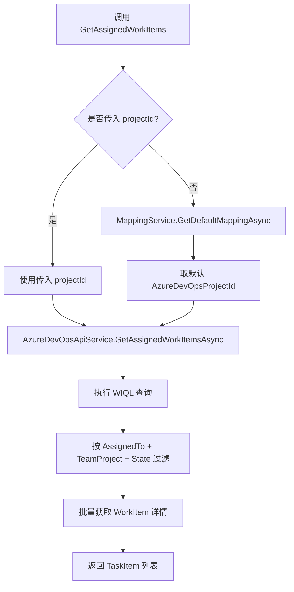
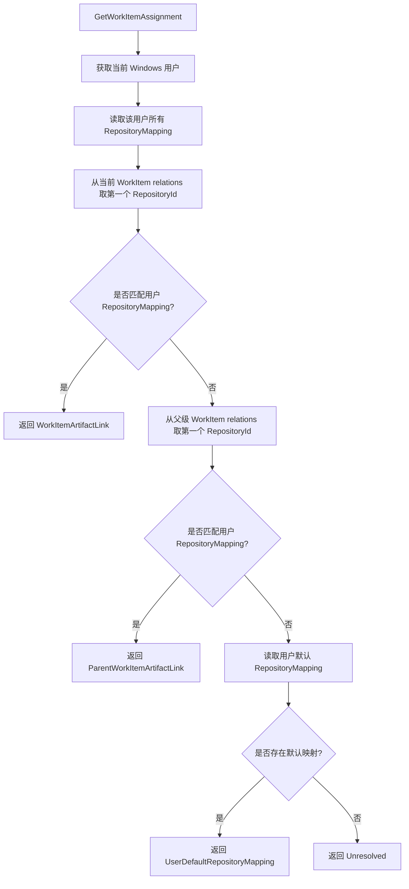
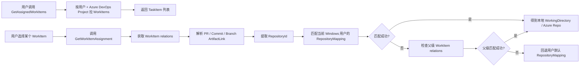

# WorkItem 与当前仓库关联机制说明

## 目的

本文档整理当前代码中“用户拉取任务”和“WorkItem 关联仓库”的实现方式，说明当前系统如何从 Azure DevOps WorkItem 推断对应的 Azure Repo，以及该机制的边界和风险。

## 相关代码位置

| 模块 | 文件 | 职责 |
| --- | --- | --- |
| WorkItem MCP 工具 | `src/AzureDevOpsMcpServer/Tools/WorkItemTool.cs` | 暴露 WorkItem 查询、详情、关系解析、仓库自动推断等 MCP 工具 |
| Azure DevOps API 服务 | `src/AzureDevOpsMcpServer/Services/AzureDevOpsApiService.cs` | 调用 Azure DevOps Work Item Tracking / Git API |
| WorkItem 关系模型 | `src/AzureDevOpsMcpServer/Models/WorkItemRelationInfo.cs` | 解析 WorkItem relation，识别 PR、Commit、Branch、父子 WorkItem |
| WorkItem 上下文模型 | `src/AzureDevOpsMcpServer/Models/WorkItemAssignment.cs` | 返回 WorkItem、父级 WorkItem、本地仓库映射和解析来源 |
| 仓库映射服务 | `src/AzureDevOpsMcpServer/Services/RepositoryMappingService.cs` | 维护当前 Windows 用户的本地项目 / 本地目录 / Azure Repo 映射 |
| 仓库映射 MCP 工具 | `src/AzureDevOpsMcpServer/Tools/RepositoryMappingTool.cs` | 暴露设置、查询当前用户仓库映射的 MCP 工具 |

## 当前用户拉取任务的实现

当前用户拉取任务的主入口是：

- `WorkItemTool.GetAssignedWorkItems(userId, projectId = null)`

当前流程如下：



`AzureDevOpsApiService.GetAssignedWorkItemsAsync` 使用的核心 WIQL 条件是：

```text
WHERE [System.AssignedTo] = '{userId}'
  AND [System.TeamProject] = '{projectId}'
  AND [System.State] <> 'Closed'
  AND [System.State] <> 'Removed'
```

因此，当前“拉取任务”的过滤维度是：

1. Azure DevOps 用户：`System.AssignedTo`
2. Azure DevOps 项目：`System.TeamProject`
3. WorkItem 状态：排除 `Closed` 和 `Removed`

当前任务拉取**没有直接按当前本地仓库 / Azure Repo 过滤**。

## 当前仓库映射的配置方式

当前仓库映射由 `RepositoryMappingTool.SetRepositoryMapping` 配置。

关键字段位于 `RepositoryMapping`：

| 字段 | 含义 |
| --- | --- |
| `WindowsUsername` | 当前 Windows 用户名，用于隔离不同用户的本地映射 |
| `AzureDevOpsUser` | 当前 Windows 用户对应的 Azure DevOps 用户 |
| `LocalProjectName` | 本地项目名 |
| `WorkingDirectory` | 本地工作目录路径 |
| `AzureDevOpsProjectId` | Azure DevOps 项目 ID |
| `AzureDevOpsProjectName` | Azure DevOps 项目名称 |
| `RepositoryId` | Azure Repo ID |
| `RepositoryName` | Azure Repo 名称 |
| `RemoteUrl` | Azure Repo 远程地址 |
| `Organization` | Azure DevOps 组织 |
| `IsDefault` | 是否为当前用户默认仓库映射 |

仓库映射可以通过以下方式查询：

- `GetRepositoryMapping(localProject)`：按本地项目名查。
- `GetRepositoryMappingByWorkingDirectory(workingDirectory)`：按本地工作目录查。
- `GetDefaultRepositoryMapping()`：查当前 Windows 用户默认仓库映射。
- `GetAllRepositoryMappings()`：查当前 Windows 用户所有仓库映射。

## 当前 WorkItem 关联仓库的实现

当前 WorkItem 关联仓库不是发生在批量拉任务阶段，而是在获取单个 WorkItem 上下文时发生。

相关入口：

- `WorkItemTool.GetWorkItemDetailsWithRelations(workItemId)`
- `WorkItemTool.GetWorkItemAssignment(workItemId)`
- `WorkItemTool.AutoResolveRepositoryForWorkItem(workItemId)`

### 1. 获取 WorkItem relations

`AzureDevOpsApiService.GetWorkItemDetailsWithRelationsAsync` 调用：

```text
witClient.GetWorkItemAsync(workItemId, expand: WorkItemExpand.Relations)
```

然后把 Azure DevOps 原始 relation 转成 `WorkItemRelationInfo`：

```text
WorkItemRelationInfo.FromAzureDevOpsRelation(relation.Rel, relation.Attributes["name"], relation.Url)
```

### 2. 判断 relation 类型

`WorkItemRelationInfo.DetermineLinkType` 根据 relation 的 `name` 和 `url` 判断类型。

当前支持：

| LinkType | 判断依据 |
| --- | --- |
| `ParentWorkItem` | URL 包含 `Hierarchy-Reverse` 或 name 包含 `Parent` |
| `ChildWorkItem` | URL 包含 `Hierarchy-Forward` 或 name 包含 `Child` |
| `PullRequest` | name 包含 `Pull Request` 或 URL 包含 `PullRequest` |
| `Commit` | name 包含 `Commit` 或 URL 包含 `Commit` |
| `Branch` | name 包含 `Branch` 或 URL 包含 `Ref` |
| `Unknown` | 以上都不匹配 |

### 3. 从 Git ArtifactLink URL 解析仓库信息

`WorkItemRelationInfo.ApplyGitArtifactParts` 根据 `LinkType` 选择 URL marker：

| LinkType | URL marker |
| --- | --- |
| `PullRequest` | `PullRequestId/` |
| `Commit` | `Commit/` |
| `Branch` | `Ref/` |

然后取 marker 后面的 payload，做 URL decode，并按 `/` 拆分：

```text
ProjectId / RepositoryId / PullRequestId|CommitId|BranchName
```

示例：

```text
vstfs:///Git/PullRequestId/project-1%2Frepo-1%2F42
```

解析结果：

| 字段 | 值 |
| --- | --- |
| `ProjectId` | `project-1` |
| `RepositoryId` | `repo-1` |
| `PullRequestId` | `42` |
| `LinkType` | `PullRequest` |

Branch 类型会把第三段解析为 `BranchName`。

### 4. 查找父级 WorkItem

`WorkItemTool.GetWorkItemAssignment` 会先获取当前 WorkItem 的 relations，然后查找父级：

```text
relation.LinkType == WorkItemRelationLinkType.ParentWorkItem
```

如果父级 relation 中包含 WorkItem ID，则继续调用 `GetWorkItemDetailsWithRelationsAsync(parentId)` 获取父级 WorkItem 的 relations。

### 5. 解析仓库映射

仓库解析逻辑在 `WorkItemTool.ResolveRepositoryMappingAsync`。

当前优先级：



对应的解析来源定义在 `RepositoryResolutionSource`：

| Source | 含义 |
| --- | --- |
| `Unresolved` | 无法解析仓库 |
| `WorkItemArtifactLink` | 从当前 WorkItem 的 PR / Commit / Branch relation 解析到仓库 |
| `ParentWorkItemArtifactLink` | 从父级 WorkItem 的 PR / Commit / Branch relation 解析到仓库 |
| `UserDefaultRepositoryMapping` | 未从 relations 解析到仓库，回退到当前用户默认仓库映射 |

## 当前完整关联链路



## 当前实现的关键特征

1. **任务列表查询按 Project，不按 Repo。**
   - `GetAssignedWorkItems` 只用 Azure DevOps Project 过滤。
   - 同一个 Azure DevOps Project 下多个 Repo 的任务可能一起返回。

2. **仓库推断发生在单个 WorkItem 上下文阶段。**
   - `GetWorkItemAssignment` 会解析 WorkItem / 父级 WorkItem 的 relations。
   - `GetAssignedWorkItems` 本身不会自动解析每个任务的仓库。

3. **仓库识别依赖 WorkItem ArtifactLink。**
   - 当前主要识别 PR、Commit、Branch 三种代码资产关系。
   - 没有关联 PR / Commit / Branch 的新任务，通常无法通过 relations 识别 repo。

4. **当前只取第一个 RepositoryId。**
   - `GetFirstRepositoryId` 会取 relations 中第一个非空 `RepositoryId`。
   - 如果一个 WorkItem 关联多个 repo，当前逻辑不会处理歧义。

5. **匹配时只用 RepositoryId。**
   - 当前 `FindMappingByRepositoryId` 只比较 `RepositoryId`。
   - 没有同时校验 `ProjectId` / `Organization`。

6. **解析失败会回退默认仓库。**
   - 如果当前 WorkItem 和父级 WorkItem 都没有可匹配的 repo，系统会返回当前用户默认 `RepositoryMapping`。
   - 这可能导致“看起来解析成功，但实际只是默认值”。

## 当前机制的风险

| 风险 | 说明 |
| --- | --- |
| 跨仓库任务混入 | 同一 Azure DevOps Project 下多个 Repo 时，任务列表不会按 Repo 过滤 |
| 新任务无法识别仓库 | 新任务通常还没有 Branch / Commit / PR relation |
| 默认映射误判 | relation 无法解析时会回退默认仓库，可能把任务归到错误仓库 |
| 多仓库关系歧义 | 一个 WorkItem 关联多个 repo 时只取第一个，缺少冲突处理 |
| 匹配条件偏弱 | 只按 `RepositoryId` 匹配，没有同时校验 Project / Organization |
| Branch 依赖不稳定 | 并非所有 WorkItem 都会先建 branch，且 branch 命名无法保证代表任务归属 |

## 当前结论

当前系统的实际语义是：

> 批量拉取“当前 Azure DevOps Project 下分配给用户的 WorkItem”；当用户查看单个 WorkItem 上下文时，再根据 WorkItem 或父级 WorkItem 关联的 PR / Commit / Branch ArtifactLink 推断 Azure Repo；如果推断失败，则回退到当前用户默认仓库映射。

它还不是严格意义上的：

> 拉取“当前本地仓库对应的任务”。

如果要实现“当前仓库任务”，需要在任务拉取入口引入 `RepositoryMapping`，并在返回任务列表前按当前仓库的 `AzureDevOpsProjectId + RepositoryId` 做过滤或标记。
